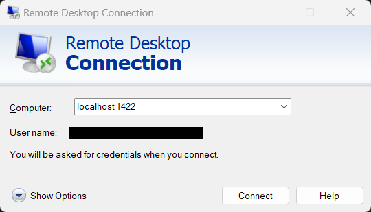
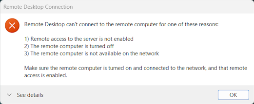
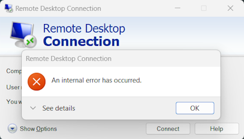
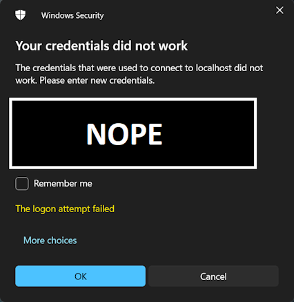

Setting Up SSH Tunnel for Windows RDP via PSU Linux Servers
===================================================

* auto-gen TOC:
{:toc}

## Before Setting Up

Prior to starting, validate that your Remote PC or Laptop is able to Remote Desktop to your Home PC while they are both on the same network.

## Getting Set Up

To set up the tunnel, make sure that you are using an SSH key to connect to the schools servers without needing to enter a password.

While we will use a specific example port throughout this document, *do not use that port number*. Instead, use a port number that is unique to you, and that you will remember. For example, if your PSU ID number is `123456789`, you might use port `56789`. If you are using a port number that is already in use, you will get an error when you try to connect, and you'll need to pick a different port number.

Next, on your home PC, create a batch file (`*.bat`). Inside, enter the following line:

```zsh
$ ssh -NR 1222:localhost:3389 linux.cs.pdx.edu -l <mcecsusername>
```

This creates a tunnel from port `1222` on the school's servers to port `3389` on your home PC.

Where `<mcecsusername>` is the username you use to log in to the college's servers. Save and close the file.

Next, on your laptop or remote machine, create another batch file (`*.bat`).  Inside, enter the following line:

```zsh
$ ssh -NL 1422:localhost:1222 linux.cs.pdx.edu -l <mcecsusername>
```

Where `<mcecsusername>` is the username you use to log in to the school's servers. Save and close the file.

This creates a tunnel from port `1422` on the laptop to port `1222` on the school's servers. Note the common port from these two commands is `1222`, and exists on the school's servers. *It is important for these to match!*

Next, navigate to the following folder: `C:\Users\%USERNAME%\.ssh` and edit the `config` file at this location, if you do not have one, create one at this time.

Add the following lines to your `config` file, this will help to ensure that the connection stays live:

```
Host *
    ServerAliveInterval 30
    ServerAliveCountMax 3
```

## Using the Tunnel

When you leave to go to school, double-click or execute the batch file you created on your home or target PC. This will launch a terminal window on this PC. Closing the window will close the connection, so leave this terminal open.

When you are ready to connect from your remote PC, double-click or execute the batch file you created on your remote PC. As before, a terminal window will launch, closing this window will close the connection.

Finally, launch Remote Desktop, and set the target Computer to: `localhost:1422`, and click Connect:



If everything has been set up, and you were able to remote over local network previously, you should connect at this time.

## Common Issues:

### Connection Spins and then fails to connect:



This error may indicate that there is an issue with the Tunnel on the device you are trying to remote *from*. Validate that you can connect to the schools servers with the same `[mcecsusername]` via SSH from the device you are trying to remote *from*, and that your connection scripts have the correct ports for their locations as listed above.

### Connection begins, and then immediately errors out:



This error may indicate that there is an issue with the Tunnel on the device you are trying to remote *to*. Validate that you can connect to the schools servers with the same `[mcecsusername]` via SSH from the device that you are trying to remote *to*, and that your connection scripts have the correct ports for their locations as listed above.

### Repeated Credential Failure:



Double check your windows credentials via password, and re-validate that you can connect via remote desktop and password while on a local network with the target device.

## Additional Considerations
I am unsure how remote desktop works with Mac systems. However, this guide may work for Mac with some modifications. Namely:
- Replace the use of batch files (\*.bat) with a bash or shell script (\*.sh)
- Mac Remote Desktop appears to use port number `5900`, so you may need to replace the port number `3389` in the first step with port number `5900` or other appropriate port.
- The location of your `C:\Users\%USERNAME%\.ssh\config` file will likely be at: `~/.ssh/config`
