VM Setup on Windows without paying for virtualization software

* auto-gen TOC:
{:toc}

## Requirements

In order to use Hyper-V, you need to be running Windows 10 or Windows 11 in Pro, Enterprise, or Education forms. If you are using Windows Home (10 or 11), you need to upgrade your license to one of the higher tiers. "But that costs money!" you say? Normally. But not for you!

Go to the [Microsoft Software for Students](https://cat.pdx.edu/services/software/users/microsoft-software/) page, and follow the instructions for obtaining an account on the Azure Portal. Once you have access, you can obtain a new license key for Windows 10 or 11 Education, allowing you to use Hyper-V.

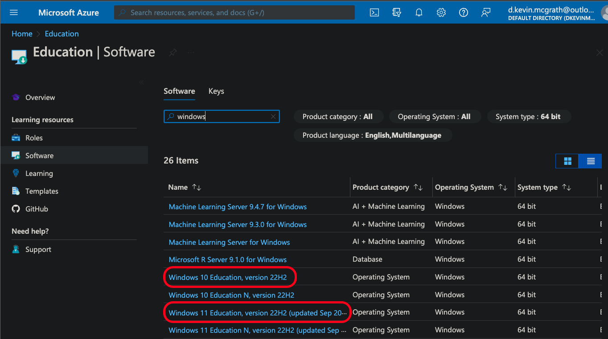

I would strongly encourage you to move to Windows 11, but that's ultimately your decision.

The commands below will install some useful tooling and then enable the Hyper-V features you need. You'll need to reboot after running it, but once you do, you'll be ready to go! Copy this script into a file with extension `.ps1` and run it via an Administrator PowerShell prompt. You'll need to change your execution policy in order to do so:

```powershell
$ Set-ExecutionPolicy Bypass -Scope Process -Force; ./install.ps1
```

```powershell
#install chocolatey
Write-Host "Installing chocolatey..."
Set-ExecutionPolicy Bypass -Scope Process -Force; [System.Net.ServicePointManager]::SecurityProtocol = [System.Net.ServicePointManager]::SecurityProtocol -bor 3072; Invoke-Expression ((New-Object System.Net.WebClient).DownloadString('https://community.chocolatey.org/install.ps1'))
Set-ExecutionPolicy -ExecutionPolicy RemoteSigned
refreshenv

Write-Host "Installing packages via chocolatey..."
#feel free to edit the below to only install the parts you want
choco install -y 7zip notepadplusplus chocolatey-core.extension powershell-core git microsoft-windows-terminal terminal-icons.powershell nerdfont-hack inconsolata firanf powertoys vscode 
# The below installs texlive if you want a more unix-like tex install
Write-Host "If you want to install a full texlive instance, run the following command:"
$s = 'choco install -y texlive --params "' + "'" + "/scheme:full'" + '"'
Write-Host $s
# choco install -y texlive --params "'/scheme:full'"

Write-Host "Installing modules via PowerShell..."
# The below is to setup the PowerShell prompt to be more useful to you
Install-Module -Name ImportExcel
Install-Module -Name Pansies -AllowClobber
Install-Module -Name Pscx -AllowPrerelease
Install-Module -Name PowerColorLS
Install-Module -Name Posh-Git
Install-Module -Name PSReadLine -AllowPrerelease -Force

Write-Host "Installing oh-my-posh via winget (you may have to accept a license)..."
# This may or may not work on the version of windows you have installed:
winget install JanDeDobbeleer.OhMyPosh 
# if the above failed, install https://www.microsoft.com/en-us/p/app-installer/9nblggh4nns1?rtc=1&activetab=pivot:overviewtab and try again

Write-Host "Enabling Hyper-V features..."
if (!((Get-WindowsOptionalFeature -online -FeatureName Microsoft-Hyper-V).State -eq 'Enabled')) {
  Enable-WindowsOptionalFeature -online -FeatureName Microsoft-Hyper-V -All -NoRestart
}
if (!((Get-WindowsOptionalFeature -online -FeatureName VirtualMachinePlatform).State -eq 'Enabled')) {
  Enable-WindowsOptionalFeature -online -FeatureName VirtualMachinePlatform -All -NoRestart
}
if (!((Get-WindowsOptionalFeature -online -FeatureName HypervisorPlatform).State -eq 'Enabled')) {
  Enable-WindowsOptionalFeature -online -FeatureName HypervisorPlatform -All -NoRestart
}
```

## Hyper-V Switch Setup

To create an internal network with Hyper-V, you need to create a virtual switch. This is a virtual network interface that you can attach to your VMs. You can create multiple switches, and attach multiple VMs to each switch. This allows you to create multiple networks, and to isolate them from each other. Alternatively, you can have an internal network that is shared between VMs, and then a gateway (or bastion host) between that bridges the two switches.

While we could use PowerShell to do this, we'll start with Hyper-V Manager. We'll get to the PS way of doing this later in the course. To create a switch, select "Virtual Switch Manager" under "Actions" on the right side of Hyper-V Manager.

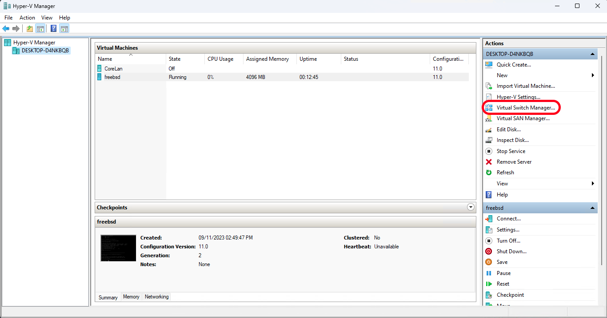

Then, select "New virtual network switch" and "Internal" as the type. Click "Create Virtual Switch".

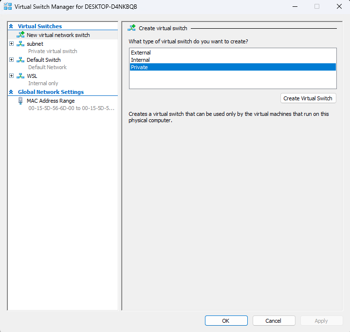

Give your switch a name, then hit "OK." You now have your internal network switch!

## VM Installation, Step by Step

1. Download your image:

   ```powershell
   ❯ # xz for windows is a cluster, so just pull down the ISO directly. It's not that big.
   ❯ Invoke-WebRequest -Uri "https://download.freebsd.org/ftp/releases/ISO-IMAGES/13.2/FreeBSD-13.2-RELEASE-amd64-dvd1.iso" -OutFile "FreeBSD-13.2-RELEASE-amd64-dvd1.iso"
   ```

1. Checksum your image:

   ```powershell
   ❯ Get-FileHash -Algorithm SHA512 -Path .\FreeBSD-13.2-RELEASE-amd64-dvd1.iso | Format-List
   
      Algorithm : SHA512
      Hash      : 7C5473B9BBC5CB235329B8FA17FFB690ABBAE67FE5E4BB30260BAA034501D3F23EBA82679A9871AF2F42E9600AFF7E9E810A0B03005AFC24962ED03945171AE1
      Path      : D:\FreeBSD-13.2-RELEASE-amd64-dvd1.iso

   ```

1. Create a new VM in Hyper-V by selection "New" and "Virtual Machine" from the right side of the Hyper-V Manager window.

    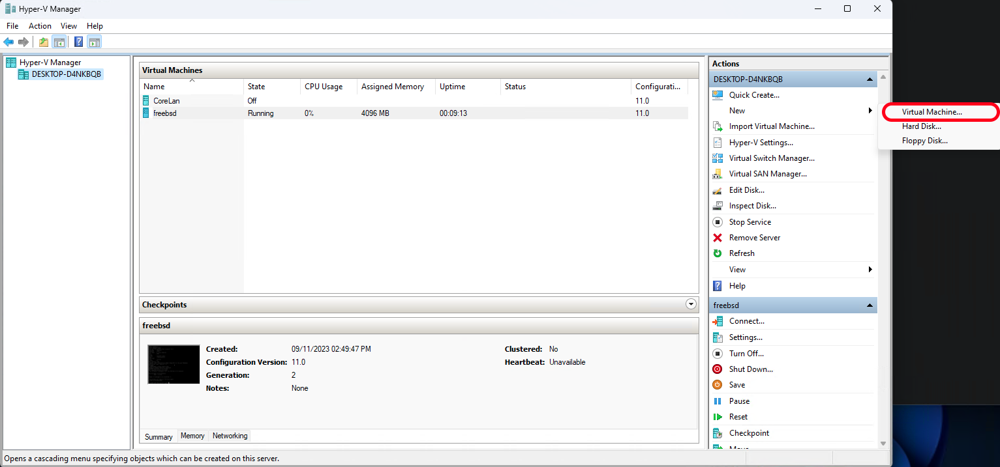

1. Give it a name (and possibly change the storage location if necessary), then click "Next".

    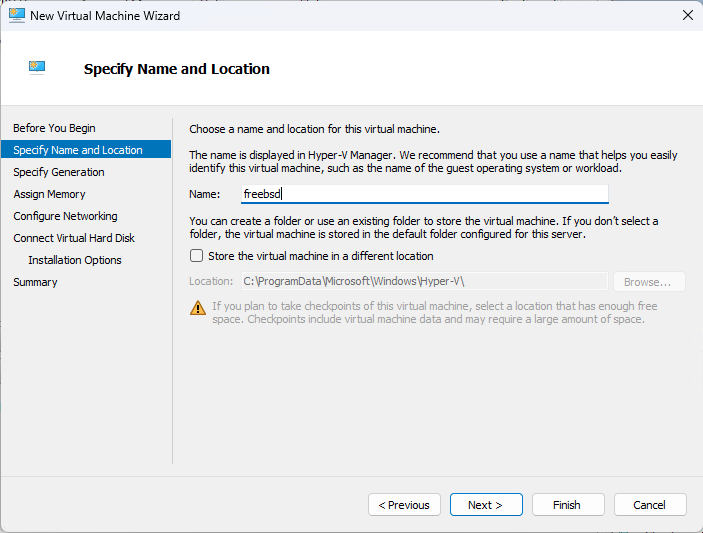

1. Select "Generation 2" for the generation of the VM. Click "Next".

    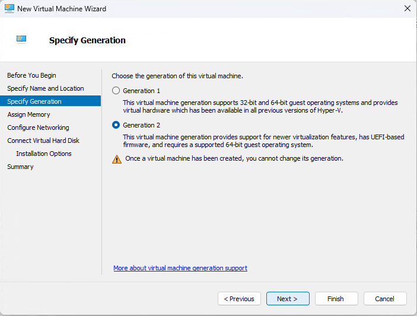

1. Assign at least 4096 MB of memory to the VM. Click "Next".

    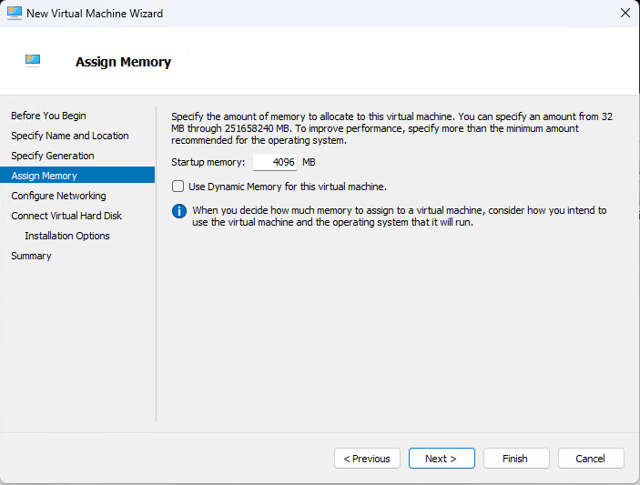

1. Set "Connection:" to "Default Switch". Click "Next".

    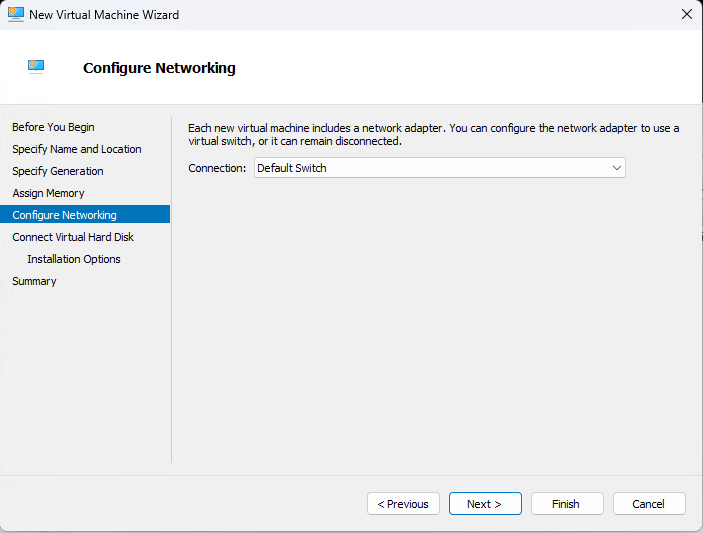

1. Create a new virtual hard disk, and set the size to 64GB. Click "Next".

    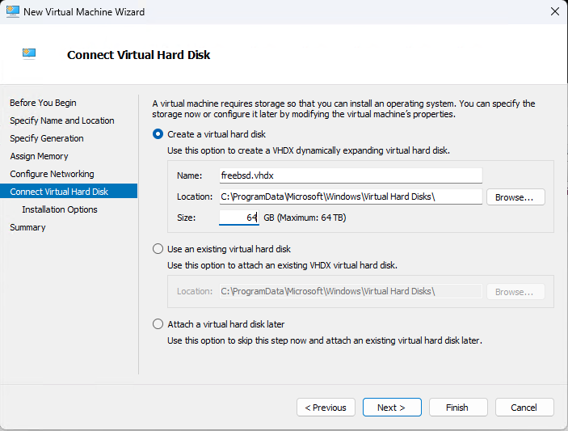

1. Select "Install an operating system from a bootable image file" and browse to the ISO you downloaded. Click "Next".

    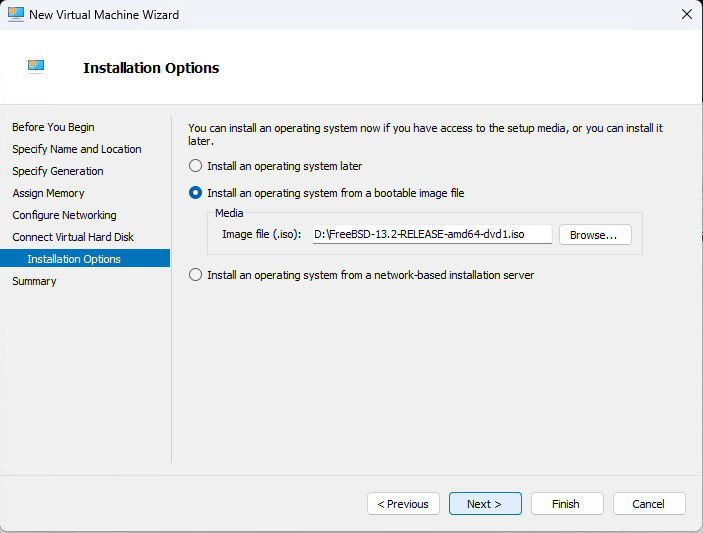

1. At the summary screen, click "Finish".

1. Before launching the VM, click on "Settings" on the right side of the Hyper-V Manager window.

    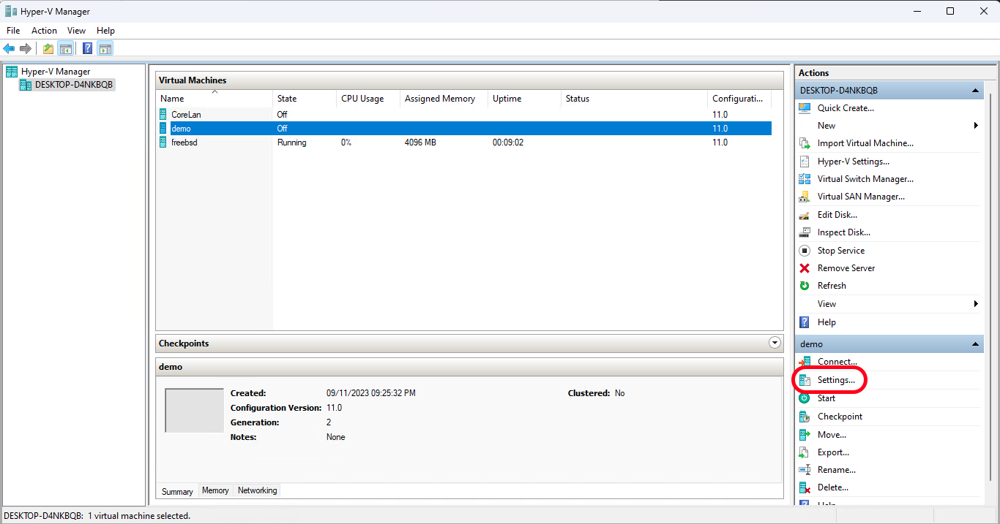

    Click "Add Hardware" and select "Network Adapter". Click "Add". On this next screen, select the switch you created previously. Click "Apply".

    Click "Security" and uncheck the box for "Enable Secure Boot". Click "Apply".

    At this point, your settings should look something like this:

    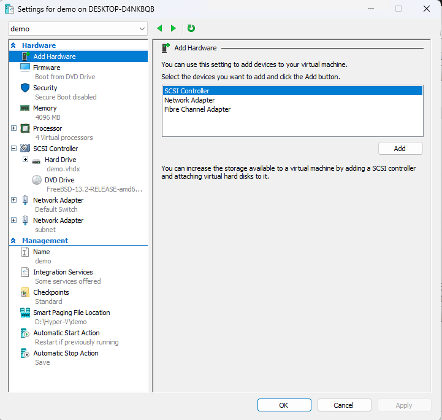

    Click "OK". Now run the VM.

1. Once the VM boots, you'll be presented with a menu. Just hit enter. Most of the defaults are what you want them to be. Some specific things to look out for:

   * The default keyboard layout is US. If you want something else, you'll need to select it.
   * Pick a hostname that you can live with.
   * You want to use Auto (ZFS) Guided Root-on-ZFS for your disk configuration.
     * On the next screen, hit T, then Enter to select your disks. You want Stripe, so hit Enter again. Hit spacebar to select the disks, then Enter to continue.
     * Hit up to select ">>> Install", then hit Enter.
   * Enter a root password ***and remember it!*** Store it securely, preferably in a password manager.
   * Setup "hn0" to use DHCP. IPv6 isn't necessary.
   * For Timezone selection, you want option 2, then option 49 (hit 5 twice then up arrow), then option 21 (hit 2 twice then down arrow). This assumes you want to use US Pacific Time. If you want something else, you'll need to figure out the appropriate option.

Once you have the freeBSD machine up and running, you can use [this script](freebsd_setup.md) to do most of what we get from pfSense.

You didn't think I was actually going to make you do all of that by hand, did you? That's just cruel. And part of what you get to do if you take my network security class. So, you know, you can do it then. But not now. Now, you get to use the script. And you'll be happy about it.

There's one caveat to the above. If you *really* don't want to use NAT on the VM, you could instead create another network switch in external mode and bridge it to a physical NIC on your PC. This is useful in situations where you want the VM to be a networking peer to your host system, but since you likely don't have multiple physical NICs on your laptop, we aren't really going to cover this much in practice. I will be talking about it in class, though.

## Ubuntu 22.04 VM Installation

With the above VM instructions, you should be able to install any additional VMs that you need. In our case, we want to use an Ubuntu 22.04 VM to run our tools and services. So, let's do that.

Snag the [Ubuntu Server for AMD64](https://releases.ubuntu.com/22.04.3/) ISO. Make sure to verify the checksums!

Once you have the ISO downloaded, create a new VM and install Ubuntu. The only setting within the VM settings you need to worry about is to change the network to use the switch you created previously on the single NIC you need for this VM. This will allow the Ubuntu VM to use the FreeBSD VM as its gateway to the outside world. You can then use the FreeBSD VM as a bastion host to access the Ubuntu VM.

As for the installer itself, you're welcome to just accept the defaults, or change to your liking. Beyond timezone settings, I'd mostly leave it alone. You can always change things later.

## Quality of life improvements for VMs

### Better interface for freeBSD VM

You may have noticed that the default console window for the freeBSD VM is...subpar. It's not the worst, but it is within hailing distance. So, let's fix that.

To do this, we need a few pieces:

* A terminal emulator that supports serial connections -- putty, MobaXTerm, etc.
* The name of the VM we want to add the pipe to -- we'll use freebsd
* The name of the pipe we want to add -- we'll use `\\.\pipe\freebsd`
* An administrative PowerShell prompt

1. First, we need to create the pipe. To do this, run the following command in an administrative PowerShell prompt:

   ```powershell
   ❯ Set-VMComPort -VMName freebsd -Number 1 \\.\pipe\freebsd
   ```

   This example assigns the first COM power (aka serial port) to the pipe `\\.\pipe\freebsd`. You can change the name of the pipe to whatever you want, but you'll need to remember it for the next step.

1. Create the named pipe instance (using [this constructor](https://learn.microsoft.com/en-us/dotnet/api/system.io.pipes.namedpipeserverstream.-ctor?view=net-7.0#system-io-pipes-namedpipeserverstream-ctor(system-string-system-io-pipes-pipedirection-system-int32-system-io-pipes-pipetransmissionmode-system-io-pipes-pipeoptions-system-int32-system-int32))) via the following command in an administrative PowerShell prompt:

   ```powershell
   ❯ New-Object System.IO.Pipes.NamedPipeServerStream("\\.\pipe\freebsd", "InOut", 100, "Byte", "None", 1024, 1024)
   ```

   That's the pipe name we used in the first step, bidirectional, at most 100 instances, byte transmission mode, no options, and default in/out buffer sizes.

1. Run putty (or whatever terminal emulator you are using) as Administrator.
1. Create a new serial connection, and set the serial line to `\\.\pipe\freebsd` (or whatever you named your pipe). Set the speed to 115200. Click "Open".

   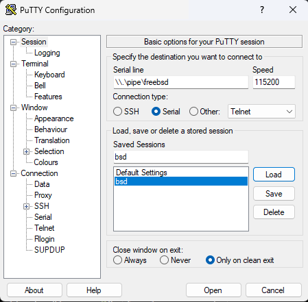

   I would recommend setting the font to something palatable, and set the window size to a known value. I use 140x40, but you can use whatever you want.

1. Now, run the VM, at the boot menu type 5 until you get to "Dual (Serial Primary)". This will direct the console output to the serial port. Hit enter to continue booting.

1. Now you can interact with the VM via putty! This means copy/paste support, better keyboard mapping, even scrolling support!

### Hyper-V Enhanced Session Mode for Ubuntu VM

Hyper-V has two modes for interacting with VMs. The default for a Linux guest is the standard console mode, which is what you get when you run a VM. The second is Enhanced Session Mode, which allows you to use RDP to connect to the VM. This is useful if you want to use a GUI on the VM, or if you want to copy/paste between the VM and your host system, or share resources in some other fashion. So how do we enable this on our Ubuntu VM?

First, and this should be obvious, you should install a desktop environment on you VM. Which you choose is entirely up to you, but I use the package `kubuntu-desktop`. Other options include `cinnamon-desktop-environment`, `ubuntu-desktop`, `lubuntu-desktop`, `ubuntu-mate-desktop`, `xubuntu-desktop`, and others. There are more DEs than you can shake a stick at!

In point of fact, I would suggest installing the following packages:

```sh
$ sudo apt install kubuntu-desktop podman docker.io zsh tmux ruby-dev fonts-inconsolata autojump bat emacs build-essential cowsay figlet filters fortunes dos2unix containerd python3-pip cargo cmake
```

Do you need all of these? Not necessarily. We will be making use of the different container runtimes, so you'll need those, at least (`podman`, `docker.io`, and `containerd`). The rest are just tools that are useful to have and that I like. Edit as you see fit.

Once you have a DE in place and running, run the below script to enable Enhanced Session Mode from the VM side. You'll need to reboot the VM after running it.

```sh
#!/bin/bash

#
# This script is for Ubuntu 22.04 Jammy Jellyfish to download and install XRDP+XORGXRDP via
# source.
#
# This script originally from Github user Hinara (https://github.com/Hinara/linux-vm-tools/blob/ubuntu20-04/ubuntu/22.04/install.sh) with modifications to work for us

# To download from the ubuntu VM:
# curl -LO https://raw.githubusercontent.com/dkmcgrath/sysadmin/main/enhanced_session.sh

# tweaked to remove some stuff that wasn't necessary.
###############################################################################
# Update our machine to the latest code if we need to.
#

if [ "$(id -u)" -ne 0 ]; then
    echo 'This script must be run with root privileges' >&2
    exit 1
fi

apt update && apt upgrade -y

if [ -f /var/run/reboot-required ]; then
    echo "A reboot is required in order to proceed with the install." >&2
    echo "Please reboot and re-run this script to finish the install." >&2
    exit 1
fi

###############################################################################
# XRDP
#

# Install hv_kvp utils for XRDP
# Install the xrdp service so we have the auto start behavior
if apt install -y xrdp linux-tools-virtual linux-cloud-tools-virtual >/dev/null 2>&1; then
    echo "Successfully installed xrdp."
else
    echo "Failed to install xrdp." >&2
    exit 1
fi

systemctl stop xrdp
systemctl stop xrdp-sesman

# Configure the installed XRDP ini files.
# use vsock transport.
sed -i_orig -e 's/port=3389/port=vsock:\/\/-1:3389/g' /etc/xrdp/xrdp.ini
# use rdp security.
sed -i_orig -e 's/security_layer=negotiate/security_layer=rdp/g' /etc/xrdp/xrdp.ini
# remove encryption validation.
sed -i_orig -e 's/crypt_level=high/crypt_level=none/g' /etc/xrdp/xrdp.ini
# disable bitmap compression since its local its much faster
sed -i_orig -e 's/bitmap_compression=true/bitmap_compression=false/g' /etc/xrdp/xrdp.ini

# rename the redirected drives to 'shared-drives'
sed -i -e 's/FuseMountName=thinclient_drives/FuseMountName=shared-drives/g' /etc/xrdp/sesman.ini

# Changed the allowed_users
sed -i_orig -e 's/allowed_users=console/allowed_users=anybody/g' /etc/X11/Xwrapper.config

# Blacklist the vmw module
if [ ! -e /etc/modprobe.d/blacklist-vmw_vsock_vmci_transport.conf ]; then
  echo "blacklist vmw_vsock_vmci_transport" > /etc/modprobe.d/blacklist-vmw_vsock_vmci_transport.conf
fi

#Ensure hv_sock gets loaded
if [ ! -e /etc/modules-load.d/hv_sock.conf ]; then
  echo "hv_sock" > /etc/modules-load.d/hv_sock.conf
fi

# Configure the policy xrdp session
cat > /etc/polkit-1/localauthority/50-local.d/45-allow-colord.pkla <<EOF
[Allow Colord all Users]
Identity=unix-user:*
Action=org.freedesktop.color-manager.create-device;org.freedesktop.color-manager.create-profile;org.freedesktop.color-manager.delete-device;org.freedesktop.color-manager.delete-profile;org.freedesktop.color-manager.modify-device;org.freedesktop.color-manager.modify-profile
ResultAny=no
ResultInactive=no
ResultActive=yes
EOF

# reconfigure the service
systemctl daemon-reload
systemctl start xrdp

#
# End XRDP
###############################################################################

echo "Install is complete."
echo "Reboot your machine to begin using XRDP."
```

After the VM is back up and running, you'll need to enable Enhanced Session Mode on the host side. To do this, open PowerShell as an Administrator and run the following command:

```powershell
❯ Set-VM -VMName <your_vm_name> -EnhancedSessionTransportType HvSocket
```

Now, when you connect to your VM from the Hyper-V manager, you'll be able to use Enhanced Session Mode!