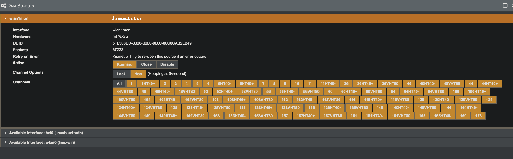
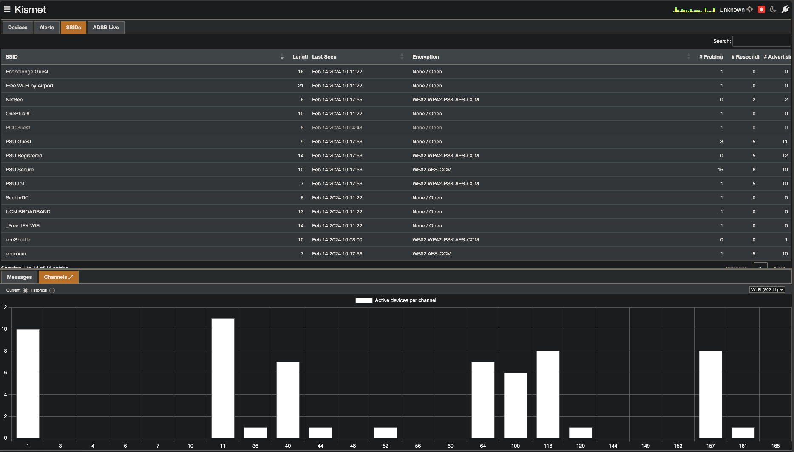
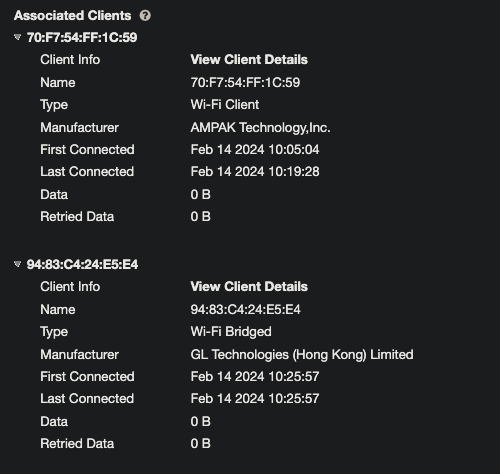
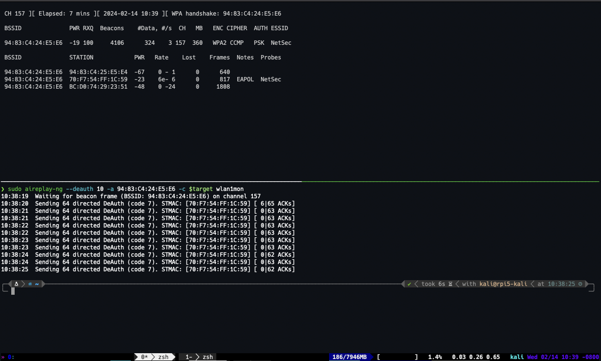
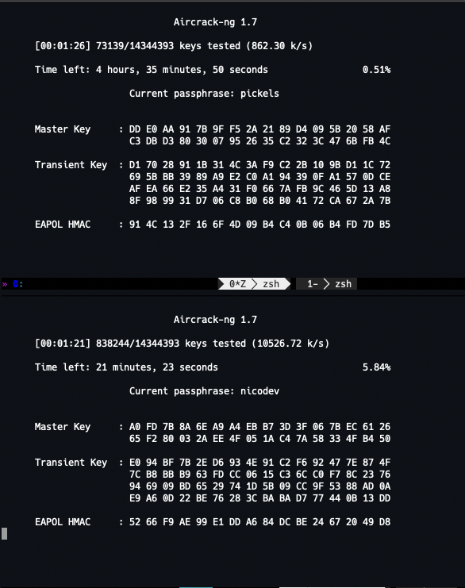

* auto-gen TOC:
{:toc}

## Introduction

Cracking WiFi is a fun and interesting exercise. It's also illegal in the general sense. So, we're going to do it in a controlled environment. We will be using a variety of tools to crack a WiFi password. This is a very common task for a security professional, and it's a good way to understand the weaknesses of WPA2.

Specifically, we will be using the `aircrack-ng` suite and `bettercap`. Everything is done on the raspberry pi unless you are told otherwise.

There are other ways to do this, but these three are some of the more common options. There is also `kismet`, but it serves more as a reconnaissance tool than a cracking tool. We will be using it.

In reality, we could do this all by hand, with capture via `tcpdump` and cracking via `hashcat`. But, that's a bit more involved than we want to get into for this class right now. Ultimately, both of the tools we will use are easier-to-use wrappers around a suite of tools. There's nothing stopping you from using the underlying tools directly, and in fact, I encourage you to do so if you're interested.

## The many modes of WiFi

There are four main modes you can put a wireless card into:

1. **Managed**: This is the default mode. It's the mode your card is in when you're connected to a network. It's the mode that allows you to connect to a network. Sometimes called **STA** (station) mode.
1. **Monitor**: This is the mode we will be using. It allows us to capture all the packets in the air. This is the mode that allows us to capture all the packets in the air that we can read, not just the ones destined for our card.
1. **Master**: This is the mode that allows your card to act as an access point. This is the mode that allows you to create a network. Sometimes called **AP** (access point) mode.
1. **Ad-hoc**: This is a mode that allows you to connect to other devices without an access point. It's not used much anymore for PCs or phones, though it is used in some IoT devices.

Looking at the above list, I hope you can figure out what mode we want to be in to capture all the packets in the air.

There are multiple ways to put a card into monitor mode. This assumes, of course, the card is capable of monitor mode. While I'd like to say most modern cards are, it's simply not true. While often the hardware might support it, there are often driver issues that prevent it from working. This is especially true on Windows, where the drivers are often closed-source and not well supported.

We will be using Alfa USB WiFi cards. While these come in many shapes and flavors, I'll save you the hassle of figuring out which to buy and just supply them pre-attached to the Pis we will be using. Best part? Kali Linux has the drivers built in, and they work out-of-the-box.

## So how do we go into monitor mode?

First, let's make sure Linux can see the USB card

```sh
❯ lsusb
Bus 001 Device 001: ID 1d6b:0002 Linux Foundation 2.0 root hub
Bus 002 Device 001: ID 1d6b:0003 Linux Foundation 3.0 root hub
Bus 003 Device 001: ID 1d6b:0002 Linux Foundation 2.0 root hub
Bus 004 Device 001: ID 1d6b:0003 Linux Foundation 3.0 root hub
Bus 004 Device 002: ID 0e8d:7612 MediaTek Inc. MT7612U 802.11a/b/g/n/ac Wireless Adapter
```

Next, let's verify that the card supports monitor mode:

```sh
❯ iw phy1 info | grep -i -A3 -B5 -m1 monitor
        Supported interface modes:
                 * IBSS
                 * managed
                 * AP
                 * AP/VLAN
                 * monitor
                 * mesh point
                 * P2P-client
                 * P2P-GO
```

OK, so I cheated a bit with that `grep` command. `iw` is insanely verbose. There is a **ton** of information in there. I didn't want to copy it all, but if your command returns the same as what's above, you're good to go. If it doesn't, you need to look at the full output. I'd suggest piping it to `less` and then searching for `monitor`.

Awesome, we have a card that supports monitor mode. Now, let's put it into monitor mode.

The simplest way:

```sh
❯ sudo airmon-ng check kill
❯ sudo airmon-ng start wlan1


PHY     Interface       Driver          Chipset

phy0    wlan0           brcmfmac        Broadcom 43455
phy1    wlan1           mt76x2u         MediaTek Inc. MT7612U 802.11a/b/g/n/ac
                (mac80211 monitor mode vif enabled for [phy1]wlan1 on [phy1]wlan1mon)
                (mac80211 station mode vif disabled for [phy1]wlan1)


```

This will kill any potentially conflicting prorcesses, then put wlan1 into monitor mode. You can then use `iwconfig` to verify that it's in monitor mode.

```sh
❯ iwconfig
lo        no wireless extensions.

eth0      no wireless extensions.

wlan0     IEEE 802.11  ESSID:off/any
          Mode:Managed  Access Point: Not-Associated
          Retry short limit:7   RTS thr:off   Fragment thr:off
          Power Management:on

docker0   no wireless extensions.

wlan1mon  IEEE 802.11  Mode:Monitor  Frequency:2.457 GHz  Tx-Power=23 dBm
          Retry short limit:7   RTS thr:off   Fragment thr:off
          Power Management:on

```

Notice that there is now no longer a `wlan1` interface, but a `wlan1mon` interface. This is the monitor mode interface.

To do the same with `iwconfig`:

```sh
❯ sudo iwconfig wlan1 mode Monitor
```

This has the disadvantage of not killing any conflicting processes, but it doesn't require additional software to be installed. That said, `airmon-ng` is a part of the `aircrack-ng` suite, and is generally installed by default on Kali Linux. So just use `airmon-ng`.

## Some terminology

Before we move on, let's define some terms:

* BSSID - The MAC address of the AP
* Channel - Defined chunk of EM spectrum. Defined by center frequency and width (in MHz). See [list of WLAN channels](https://en.wikipedia.org/wiki/List_of_WLAN_channels) for more information. Specifically, pay attention to the 2.4GHz and 5GHz bands.
* WPA - WiFi Protected Access
* ESSID - The network name. Sometimes hidden, but not really.
* Station - A device connected to the AP
* WEP - Wired Equivalent Privacy. It's not. It's not even close. It's a joke. Don't use it.
* WPA2-Enterprise - Also known as RADIUS (Remote Authentication Dial-In User Service). It's a protocol that allows for centralized authentication, authorization, and accounting for network access. It's used in a lot of enterprise networks. It's also not something we will be dealing with in this class, as it uses per-session keys, and is generally considered secure. It's also a pain to set up, and I don't want to deal with it.

## Now what?

There are several steps that need to be acocmplished to crack a WiFi password:

1. [x] Put the card into monitor mode and start monitoring for packets (should already be done)
1. [ ] Determine the BSSID, ESSID, and channel of the network we want to crack.
1. [ ] Find a machine currently connected to the wireless network.
1. [ ] Initiate a deauth attack against the machine identified in the previous step.
1. [ ] Capture the handshake.
1. [ ] Crack the password.

We should already know the ESSID of the network (NetSec). We can find the BSSID and channel with `kismet`.

Launch `kismet`:

```sh
❯ kismet
```

You will get some terminal output, and then a banner across your terminal that tells you to connect to `http://localhost:2501`. Since this is running remotely on the raspberry pi, you'll want to connect to `http://<pi's IP>:2501` from your laptop. You can find the IP of the pi with `ip a s` or `ifconfig`.

Once you connect, you'll see a blank kismet interface. Click the pancake menu and select sources. You want to select `wlan1mon` as the source.



You can select which channels to hop over, whether they hop or are locked, and you can disable or start the source. Make sure it's started now, and then close the popup window.

Click on SSIDs, and you should see something like the following:



I have selected the Channels tab in the bottom window to see where networks are currently. You can see that the NetSec network is on channel 157, and the BSSID is `94:83:C4:24:E5:E6`. This is the information we need to proceed.

Click on the NetSec SSID, and you'll see more information. Click on "View Device Details" to get the second of the windows below.


Now that you have that window open, select the "WiFi" tab. Scroll down to the bottom, and you should see **Associate Clients**. This is a list of all the devices currently connected to the network. You can see that there are two devices connected to the network. We will need to deauth one of them to capture the handshake.



Go ahead and shut down kismet. We don't need it running right now.

## Deauth and capture

You will need two terminal windows for the next step.

Launch `airodump-ng`:

```sh
❯ sudo airodump-ng --channel 157 --bssid 94:83:C4:24:E5:E6 --write netsec wlan1mon
```

In another terminal (I split horizontally in tmux), launch `aireplay-ng`:

```sh
❯ sudo aireplay-ng --deauth 10 -a 94:83:C4:24:E5:E6 -c $target wlan1mon
```

Where you set the `$target` to the MAC address of one of the devices connected to the network. You can see the MAC addresses in the "Station" column of the `airodump-ng` output.

What you are doing is sending deauthentication packets to the target device. This will cause it to disconnect from the network. When it reconnects, it will send a handshake. This is what we want to capture.

If we successfully capture the handshake, you will see a message in the `airodump-ng` window that says "WPA handshake: 94:83:C4:24:E5:E6". This is what we want to see.



Once you have that, you can quit out of `airodump-ng` by hitting `Q` twice. You should see a file called `netsec-01.cap` in your directory. This is the file we will use to crack the password.

## Cracking the password

Now that we have the handshake, we can use `aircrack-ng` to crack the password. This is a dictionary attack, so you will need a wordlist. There are many available online. I suggest using `rockyou.txt` as it's a very large wordlist. You can snag a corrected copy via `scp` from `ada.cs.pdx.edu:/disk/scratch/dmcgrath/rockyou.txt`.

```sh
❯ aircrack-ng --bssid 94:83:C4:24:E5:E6 -w rockyou.txt netsec-01.cap
```

As a point of comparison, I ran the crack on both my laptop and a raspberry pi 5. The laptop took 1m 30s, and the pi took 19m 6s. Some of you are running on a pi 3, so I strongly encourage you to move the files to your VM and run the crack there. It will be much faster.



As you can see, the pi is running at ~860 keys/second, while my laptop is running at ~10.5k keys/second. This is a significant difference. The pi 3 is even slower than the pi 5. The pi 3 is running at ~400 keys/second. I don't really want you to be running the crack for 20 minutes. It's not a good use of your time.