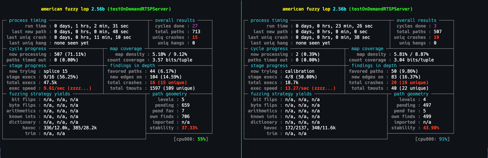

# HW4: Fuzzing

Due Date: 2024-03-17 23:59:59

* auto-gen TOC:
{:toc}

## Introduction

This is adapted from the AFLnet tutorial. And by adapted, I mean I'm making use of their tutorial.

## Update

### Update to the update

OK, so what do you do if you don't have access to an x86 machine? I'm assuming this is only relevant to the Apple M1/2/3 crowd, but I could be wrong. Turns out you can do this via Qemu emulation within UTM.

Steps to recreate:

1. Download [the Ubuntu 18.04 Server ISO](https://releases.ubuntu.com/18.04/ubuntu-18.04.6-live-server-amd64.iso).
1. Create a new VM in UTM, selecting Emulation.
1. Point this new VM at the Ubuntu ISO you downloaded previously.
1. Within the VM settings, you'll want to specify at least 2 cores, and at least 4GB of RAM. Please check the "Force multi-core" box.
1. Boot the VM and install Ubuntu.
1. Follow the AFLnet instructions as normal -- don't use Docker!

### Original update

This requires the use of an x86 machine. I don't have a lot of spare x86 machines lying around, but I do have some. Please reach out individually via email if you need access to an x86 machine to complete this assignment.

If you are running into trouble getting this to run on your x86 machine, you can use this Dockerfile to build a working image:

```Dockerfile
# syntax=docker/dockerfile-upstream:master-labs
FROM ubuntu:18.04

RUN apt-get -y update && \
    apt-get -y install sudo \ 
    apt-utils \
    build-essential \
    openssl \
    clang \
    graphviz-dev \
    git \ 
    libcap-dev

# Download and compile AFLNet
ENV LLVM_CONFIG="llvm-config-6.0"


RUN git clone https://github.com/aflnet/aflnet.git /opt/aflnet && cd /opt/aflnet && make clean all && cd llvm_mode && make
#WORKDIR /opt/aflnet

# Set up environment variables for AFLNet
ENV AFLNET="/opt/aflnet"
ENV PATH="${PATH}:${AFLNET}"
ENV AFL_PATH="${AFLNET}"
ENV AFL_I_DONT_CARE_ABOUT_MISSING_CRASHES=1 \
    AFL_SKIP_CPUFREQ=1
ENV WORKDIR="/home/testing"

RUN mkdir -p /home/testing/
RUN cd $WORKDIR && \
	git clone https://github.com/rgaufman/live555.git && \
	cd live555 && \
	git checkout ceeb4f4 && \
	patch -p1 < $AFLNET/tutorials/live555/ceeb4f4_states_decomposed.patch && \
	./genMakefiles linux && \
	make clean all
```

Then you can get ready to run the tests on Live555 with the following command:

```bash
❯ docker build --tag aflnet .
❯ docker run -it aflnet
```

`$WORKDIR` is set to `/home/testing`, so you can run the commands from the tutorial from there.

Running via docker on two different machines, I was able to get the following output:



Notice the different runtimes and total crashes found. Yay for stochastic processes!

## Installation

### Prerequisites

```bash
# Install clang (as required by AFL/AFLNet to enable llvm_mode)
❯ sudo apt-get install clang
# Install graphviz development
❯ sudo apt-get install graphviz-dev libcap-dev
```

### AFLNet

Download AFLNet and compile it. We have tested AFLNet on Ubuntu 18.04 and Ubuntu 16.04 64-bit and it would also work on all environments that support the vanilla AFL and [graphviz](https://graphviz.org).

```bash
# First, clone this AFLNet repository to a folder named aflnet
❯ git clone <links to the repository> aflnet
# Then move to the source code folder
❯ cd aflnet
❯ make clean all
❯ cd llvm_mode
# The following make command may not work if llvm-config cannot be found
# To fix this issue, just set the LLVM_CONFIG env. variable to the specific llvm-config version on your machine
# On Ubuntu 18.04, it could be llvm-config-6.0 if you have installed clang using apt-get
❯ make
# Move to AFLNet's parent folder
❯ cd ../..
❯ export AFLNET=$(pwd)/aflnet
❯ export WORKDIR=$(pwd)
```

### Setup PATH environment variables

```bash
❯ export PATH=$PATH:$AFLNET
❯ export AFL_PATH=$AFLNET
```

## Usage

AFLNet adds the following options to AFL. Run ```afl-fuzz --help``` to see all options. Please also see the FAQs section for common questions about these AFLNet's options.

* ***-N netinfo***: server information (e.g., tcp://127.0.0.1/8554)

* ***-P protocol***: application protocol to be tested (e.g., RTSP, FTP, DTLS12, DNS, DICOM, SMTP, SSH, TLS, DAAP-HTTP, SIP)

* ***-D usec***: (optional) waiting time (in microseconds) for the server to complete its initialization

* ***-e netnsname***: (optional) network namespace name to run the server in

* ***-K*** : (optional) send SIGTERM signal to gracefully terminate the server after consuming all request messages

* ***-E*** : (optional) enable state aware mode

* ***-R*** : (optional) enable region-level mutation operators

* ***-F*** : (optional) enable false negative reduction mode

* ***-c script*** : (optional) name or full path to a script for server cleanup

* ***-q algo***: (optional) state selection algorithm (e.g., 1. RANDOM_SELECTION, 2. ROUND_ROBIN, 3. FAVOR)

* ***-s algo***: (optional) seed selection algorithm (e.g., 1. RANDOM_SELECTION, 2. ROUND_ROBIN, 3. FAVOR)

Example command:

```bash
❯ afl-fuzz -d -i in -o out -N <server info> -x <dictionary file> -P <protocol> -D 10000 -q 3 -s 3 -E -K -R <executable binary and its arguments (e.g., port number)>
```

## Tutorial - Fuzzing Live555 media streaming server

[Live555 Streaming Media](http://live555.com) is a C++ library for multimedia streaming. The library supports open protocols such as RTP/RTCP and RTSP for streaming. It is used internally by widely-used media players such as [VLC](https://videolan.org) and [MPlayer](http://mplayerhq.hu) and some security cameras & network video recorders (e.g., [DLink D-View Cameras](http://files.dlink.com.au/products/D-ViewCam/REV_A/Manuals/Manual_v3.51/D-ViewCam_DCS-100_B1_Manual_v3.51(WW).pdf), [Senstar Symphony](http://cdn.aimetis.com/public/Library/Senstar%20Symphony%20User%20Guide%20en-US.pdf), [WISENET Video Recorder](https://www.eos.com.au/pub/media/doc/wisenet/Manuals_QRN-410S,QRN-810S,QRN-1610S_180802_EN.pdf)). In this example, we show how AFLNet can be used to fuzz Live555 and discover bugs in its RTSP server reference implementation (testOnDemandRTSPServer). Similar steps would be followed to fuzz servers implementing other protocols (e.g., FTP, SMTP, SSH).

If you want to run some experiments quickly, please take a look at [ProFuzzBench](https://github.com/profuzzbench/profuzzbench). ProFuzzBench includes a suite of representative open-source network servers for popular protocols (e.g., TLS, SSH, SMTP, FTP, SIP), and tools to automate experimentation.

### Step-0. Server and client compilation & setup

The newest source code of Live555 can be downloaded as a tarball at [Live555 public page](http://live555.com/liveMedia/public/). There is also [a mirror of the library](https://github.com/rgaufman/live555) on GitHub. In this example, we choose to fuzz an [old version of Live555](https://github.com/rgaufman/live555/commit/ceeb4f462709695b145852de309d8cd25e2dca01) which was commited to the repository on August 28th, 2018. While fuzzing this specific version of Live555, AFLNet exposed four vulnerabilites in Live555, two of which were zero-day. To compile and setup Live555, please use the following commands.

```bash
❯ cd $WORKDIR
# Clone live555 repository
❯ git clone https://github.com/rgaufman/live555.git
# Move to the folder
❯ cd live555
# Checkout the buggy version of Live555
❯ git checkout ceeb4f4
# Apply a patch. See the detailed explanation for the patch below
❯ patch -p1 < $AFLNET/tutorials/live555/ceeb4f4.patch
# Generate Makefile
❯ ./genMakefiles linux
# Compile the source
❯ make clean all
```

As you can see from the commands, we apply a patch to make the server effectively fuzzable. In addition to the changes for generating a Makefile which uses afl-clang-fast++ to do the coverage feedback-enabled instrumentation, we make a small change to disable random session ID generation in Live555. In the unmodified version of Live555, it generates a session ID for each connection and the session ID should be included in subsequent requests sent from the connected client. Otherwise, the requests are quickly rejected by the server and this leads to undeterministic paths while fuzzing. Specifically, the same message sequence could exercise different server paths because the session ID is changing. We handle this specific issue by modifing Live555 in such a way that it always generates the same session ID.

Once Live555 source code has been successfully compiled, we should see the server under test (testOnDemandRTSPServer) and the sample RTSP client (testRTSPClient) placed inside the testProgs folder. We can test the server by running the following commands.

```bash
# Move to the folder keeping the RTSP server and client
❯ cd $WORKDIR/live555/testProgs
# Copy sample media source files to the server folder
❯ cp $AFLNET/tutorials/live555/sample_media_sources/*.* ./
# Run the RTSP server on port 8554
❯ ./testOnDemandRTSPServer 8554
# Run the sample client on another screen/terminal
❯ ./testRTSPClient rtsp://127.0.0.1:8554/wavAudioTest
```

We should see the outputs from the sample client showing that it successfully connects to the server, sends requests and receives responses including streaming data from the server.

### Step-1. Prepare message sequences as seed inputs

AFLNet takes message sequences as seed inputs so we first capture some sample usage scenarios between the sample client (testRTSPClient) and the server under test (SUT). The following steps show how we prepare a seed input for AFLNet based on a usage scenario in which the server streams an audio file in WAV format to the client upon requests. The same steps can be followed to prepare other seed inputs for other media source files (e.g., WebM, MP3).

We first start the server under test

```bash
❯ cd $WORKDIR/live555/testProgs
❯ ./testOnDemandRTSPServer 8554
```

After that, we ask [tcpdump data-network packet analyzer](https://www.tcpdump.org) to capture all traffics through the port opened by the server, which is 8554 in this case. Note that you may need to change the network interface that works for your setup using the ```-i``` option.

```bash
❯ sudo tcpdump -w rtsp.pcap -i lo port 8554
```

Once both the server and tcpdump have been started, we run the sample client

```bash
❯ cd $WORKDIR/live555/testProgs
❯ ./testRTSPClient rtsp://127.0.0.1:8554/wavAudioTest
```

When the client completes its execution, we stop tcpdump. All the requests and responses in the communication between the client and the server should be stored in the specified rtsp.pcap file. Now we use [Wireshark network analyzer](https://wireshark.org) to extract only the requests and use the request sequence as a seed input for AFLNet. Please install Wireshark if you haven't done so.

We first open the PCAP file with Wireshark.

```bash
❯ wireshark rtsp.pcap
```

This is a screenshot of Wireshark. It shows packets (requests and responses) in multiple rows, one row for one packet.


To extract the request sequence, we first do a right-click and choose Follow->TCP Stream.


Wireshark will then display all requests and responses in plain text.


As we are only interested in the requests for our purpose, we choose incoming traffic to the SUT-opened port by selecting an option from the bottom-left drop-down list. We choose ```127.0.0.1:57998->127.0.0.1:8554``` in this example which askes Wireshark to display all request messages sent to port 8554.


Finally, we switch the data mode so that we can see the request sequence in raw (i.e., binary) mode. Click "Save as" and save it to a file, say rtsp_requests_wav.raw.


The newly saved file rtsp_requests_wav.raw can be fed to AFLNet as a seed input. You can follow the above steps to create other seed inputs for AFLNet, say rtsp_requests_mp3.raw and so on. We have prepared a ready-to-use seed corpus in the tutorials/live555/in-rtsp folder.

### Step-2. Make modifications to the server code (optional)

Fuzzing network servers is challenging and in several cases, we may need to slightly modify the server under test to make it (effectively and efficiently) fuzzable. For example, this [blog post](http://www.vegardno.net/2017/03/fuzzing-openssh-daemon-using-afl.html) shows several modifications to OpenSSH server to improve the fuzzing performance including disable encryption, disable MAC and so on. In this tutorial, the RTSP server uses the same response code ```200``` for all successful client requests, no matter what actual server state is. So to make fuzzing more effective, we can apply the simple patch in `tutorials/live555/ceeb4f4_states_decomposed.patch` that decomposes the big state 200 into smaller states. It makes the inferred state machine more fine grained and hence AFLNet has more information to guide the state space exploration.

### Step-3. Fuzzing

```bash
❯ cd $WORKDIR/live555/testProgs
❯ afl-fuzz -d -i $AFLNET/tutorials/live555/in-rtsp -o out-live555 -N tcp://127.0.0.1/8554 -x $AFLNET/tutorials/live555/rtsp.dict -P RTSP -D 10000 -q 3 -s 3 -E -K -R ./testOnDemandRTSPServer 8554
```

Once AFLNet discovers a bug (e.g., a crash or a hang), a test case containing the message sequence that triggers the bug will be stored in ```replayable-crashes``` or ```replayable-hangs``` folder. In the fuzzing process, AFLNet State Machine Learning component keeps inferring the implmented state machine of the SUT and a .dot file (ipsm.dot) is updated accordingly so that the user can view that file (using a .dot viewer like xdot) to monitor the current progress of AFLNet in terms of protocol inferencing. Please read the AFLNet paper for more information.

### Step-4. Reproducing the crashes found

AFLNet has an utility (aflnet-replay) which can replay message sequences stored in crash and hang-triggering files (in ```replayable-crashes``` and ```replayable-hangs``` folders). Each file is structured in such a way that aflnet-replay can extract messages based on their size. aflnet-replay takes three parameters which are 1) the path to the test case generated by AFLNet, 2) the network protocol under test, and 3) the server port number. The following commands reproduce a PoC for [CVE-2019-7314](https://cve.mitre.org/cgi-bin/cvename.cgi?name=CVE-2019-7314).

```bash
❯ cd $WORKDIR/live555/testProgs
# Start the server
❯ ./testOnDemandRTSPServer 8554
# Run aflnet-replay
❯ aflnet-replay $AFLNET/tutorials/live555/CVE_2019_7314.poc RTSP 8554
```

To get more information about the discovered bug (e.g., crash call stack), you can run the buggy server with [GDB](https://gnu.org/software/gdb) or you can apply the Address Sanitizer-Enabled patch ($AFLNET/tutorials/live555/ceeb4f4_ASAN.patch) and recompile the server before running it.

## What to turn in

Write up what you found and how you found it. Include screenshots and similar. You will also need to pick one of the other tutorials, and go through that exercise as well, writing it up as you go.

Everything should be in a markdown file in your repo called `hw4/hw4.md`. Commit and push this to your repo. Once you have done this, you can consider the assignment submitted.
