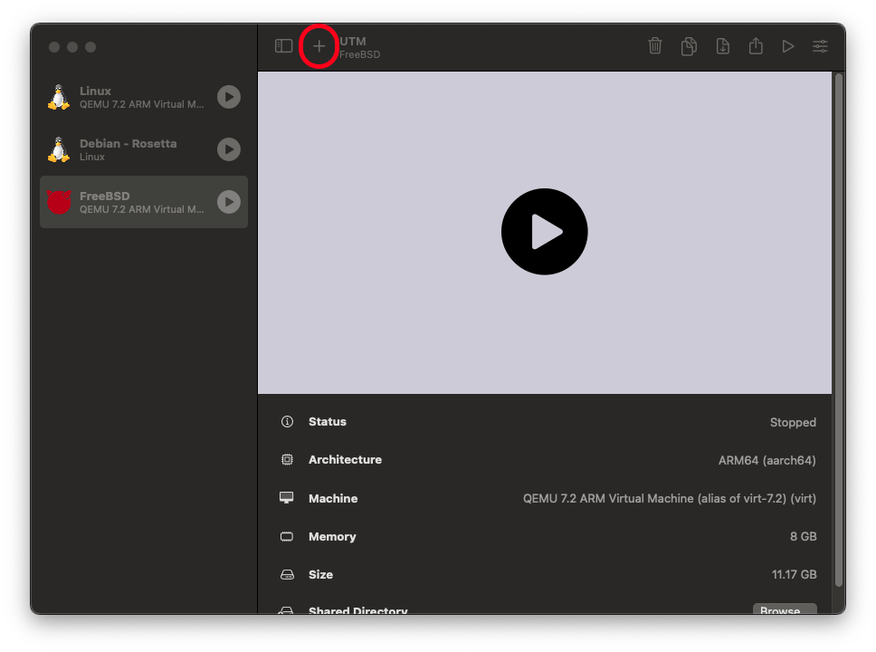
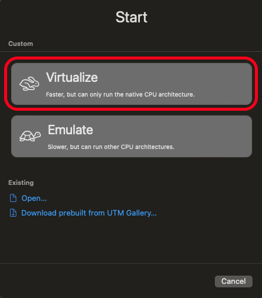
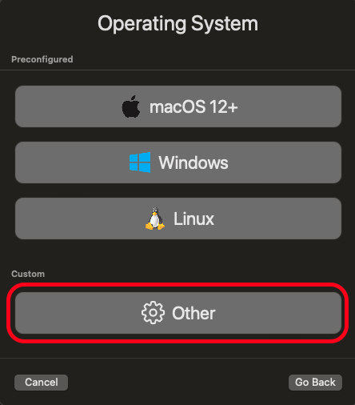
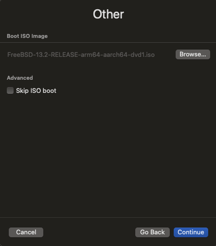
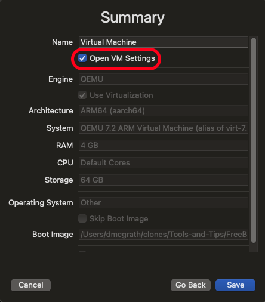

VM Setup on macOS without paying for virtualization software

* auto-gen TOC:
{:toc}

## Requirements

You will need at least 100GB or so of free space on your hard drive for this class. We won't likely use it all, but it needs to be there.

## Common tools

Setting up a VM on macOS is relatively straightforward. While you could spend lots of money to get a commercial hypervisor like Parallels Desktop or VMware Fusion, that's...ridiculous. Sure, they can do some fancy stuff, but we are sticking with open source solutions! Plus, they cost lots of money, and that's just wrong.

So, what can we use? Well, there's the option of VirtualBox if you're on an Intel Mac. But a) that requires you are on an Intel Mac, b) that requires you interact with Oracle, and c) it has been nothing but trouble in my past classes. So, don't use it. Instead, we'll use the [Universal Turing Machine (UTM)](https://github.com/utmapp/UTM/releases) software. It's free, it's open source, and it's pretty easy to use. It's also a Universal app, so it runs on both Intel and Apple Silicon Macs. More importantly, it provides an easy-to-use wrapper around the QEMU hypervisor, which is what we'll be using to run our VMs.

Alternatively, if you're a brew user, you can use

```sh
$ brew install --cask utm
```

to get UTM installed. If you're really feeling like you want to do things "The Linux Way", you can install `libvirt` and `virt-manager` via brew, and use that to manage your VMs. I'm not going to cover that here, but it's an option.

Or, you can go full masochist and use `qemu` directly. I'm not going to cover that here, either. And if you think it makes sense, why are you here? Go away. Or better yet, talk to me about becoming a TA.

## Kali VM Installation, Step by Step

OK, you have UTM installed, and you're ready to create your VM. How? Time for a little show and tell! Please only use the line appropriate for your architecture.

1. Download your image (choose correct architecture):

   ```sh
   $ curl -LO https://kali.darklab.sh/kali-images/kali-2023.4/kali-linux-2023.4-installer-arm64.iso
   $ curl -LO https://kali.darklab.sh/kali-images/kali-2023.4/kali-linux-2023.4-installer-amd64.iso
   ```

1. Checksum your image:

   ```sh
   $ sha512sum --tag kali-linux-2023.4-installer-arm64.iso kali-linux-2023.4-installer-amd64.iso
   SHA512 (kali-linux-2023.4-installer-amd64.iso) = 0b9bb5b2121533ad37e4e35c17012c89634fb66f45e5b268ea69d85cd6ea6f685c19d9c2b11ae0d6125bc66ad63be76d6b7ad3f7f26770bad392003366690fae
   SHA512 (kali-linux-2023.4-installer-arm64.iso) = 1e83d35922281e238bc05bab89a661aec13283bdb756b8becce079eaa8c97cb94cf5adced61de0554cb36de9f02f1f1f9def3650b4712cbb5d2893093fd84585
   ```

    If you don't have `sha512sum` installed, you can use `shasum -a 512` instead, though it's a perl script, so takes a bit longer.

1. Create a new VM in UTM:

   1. We can create a new VM by clicking the `+` button on the top of the UTM window. This one:

      

   1. We want to virtualize, regardless of which underlying architecture we are using.

      

   1. We aren't installing macOS, Windows, or Linux, so select other:

      

   1. Browse to wherever you downloaded the image, and select the ISO that you uncompressed.

      

      Click continue.

   1. I would suggest you give your VM at least 4GB of memory, since it's going to be the primary external interface to your work environment for this class. As for the cores, leaving it at `default` is fine, unless you want to limit it to a specific number of cores (at least 2!). Click continue.

   1. For storage, 64GB should be plenty. We can resize later as needed. Click continue.

   1. We won't be using a shared directory, so just click continue.

   1. On the summary page, ensure that "Open VM Settings" is checked. Give your VM a descriptive name -- I called my VM kali. Click "Create VM".

      

   1. You may run into an issue where the installer doesn't look like it's going to load. For some reason, the easiest way to fix this is to add a serial device to the VM. Click on the "Add Device" button, and select "Serial Port". Change any settings you like (like the font), and then click "Add Device". Then, click "Start VM".

   1. The installer is pretty self explanatory. Just follow the prompts. When you get to the disk partitioning, I would suggest you use the "Guided - use entire disk" option. This will wipe out any existing partitions on the disk, and create a new partition table. This is fine, since we're using a virtual disk, and we don't care about any data that might be on it. If you want to do something else, you can, but you're on your own. I'm not going to cover it here.

   1. When the installer is done, it doesn't ignore the disk image. So stop the VM, go into the settings, and remove the ISO from the CD-ROM drive. Then, restart the VM.