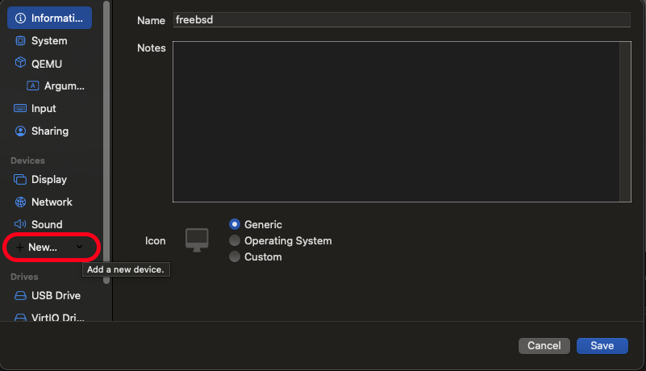
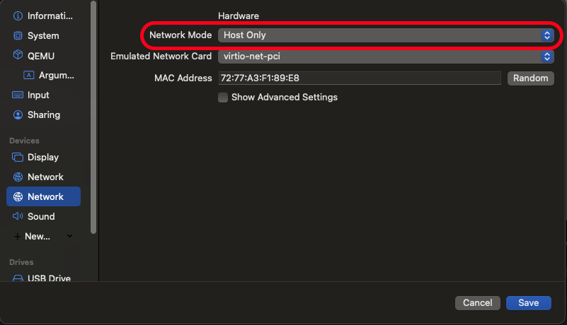
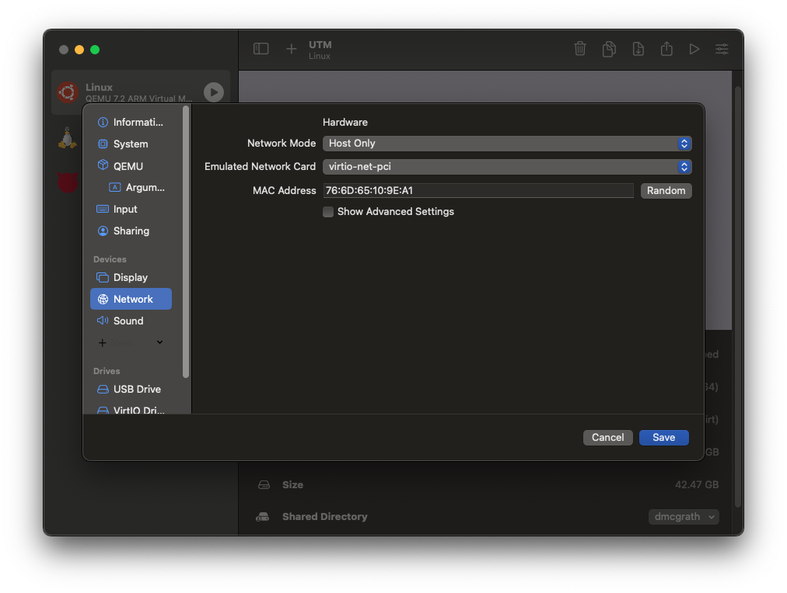
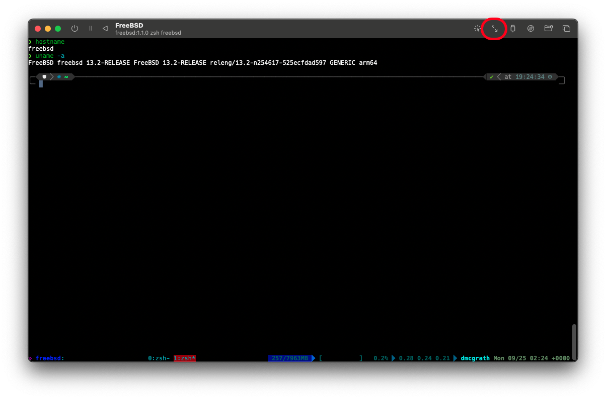

VM Setup on macOS without paying for virtualization software

* auto-gen TOC:
{:toc}

## Requirements

You will need at least 100GB or so of free space on your hard drive for this class. We won't likely use it all, but it needs to be there.

## Common tools

Setting up a VM on macOS is relatively straightforward. While you could spend lots of money to get a commercial hypervisor like Parallels Desktop or VMware Fusion, that's...ridiculous. Sure, they can do some fancy stuff, but we are sticking with open source solutions! Plus, they cost lots of money, and that's just wrong.

So, what can we use? Well, there's the option of VirtualBox if you're on an Intel Mac. But a) that requires you are on an Intel Mac, b) that requires you interact with Oracle, and c) it has been nothing but trouble in my past classes. So, don't use it. Instead, we'll use the [Universal Turing Machine (UTM)](https://github.com/utmapp/UTM/releases) software. It's free, it's open source, and it's pretty easy to use. It's also a Universal app, so it runs on both Intel and Apple Silicon Macs. More importantly, it provides an easy-to-use wrapper around the QEMU hypervisor, which is what we'll be using to run our VMs.

Alternatively, if you're a brew user, you can use

```sh
$ brew install --cask utm
```

to get UTM installed. If you're really feeling like you want to do things "The Linux Way", you can install `libvirt` and `virt-manager` via brew, and use that to manage your VMs. I'm not going to cover that here, but it's an option.

Or, you can go full masochist and use `qemu` directly. I'm not going to cover that here, either. And if you think it makes sense, why are you here? Go away. Or better yet, talk to me about becoming a TA.

## Running on Intel

If you're using an Intel Mac, you're in luck. You could take the easy road for the virtual network setup. Well, mostly easy. You could use [pfSense](https://www.pfsense.org/) directly, rather than using FreeBSD and then setting up tools yourself. But, that just isn't nearly as much fun. So read the next section and do it that way. Yes, I'm serious. You had to actually learn math before you got to use the calculator, right? Same thing here. And if that wasn't the case for you, just smile, nod, and pretend it was.

## Running on Apple Silicon (M1+)

Alas, you don't get to take the easy road, because for reasons that escape me, Netgate doesn't build ARM versions of pfSense except for their own hardware. And building pfSense for ARM is an exercise in frustration, because they go so far as to tell you to just purchase their hardware when you try. Blah, annoying. But hey, even if we could use pfSense, we aren't going to, because the Intel folks don't get to either.

So, instead of installing pfSense, just install [FreeBSD](https://download.freebsd.org/ftp/releases/ISO-IMAGES/13.2/FreeBSD-13.2-RELEASE-arm64-aarch64-dvd1.iso.xz), which is what pfSense runs on anyway. This is actually better, because we get to run on a more up-to-date platform, and we aren't missing a bunch of useful tools like the pfSense folks. Plus, we get to learn how to do things the hard way, which is always fun, right?

## FreeBSD VM Installation, Step by Step

OK, you have UTM installed, and you're ready to create your VM. How? Time for a little show and tell! Please only use the line appropriate for your architecture.

1. Download your image:

   ```sh
   $ curl -LO https://download.freebsd.org/ftp/releases/ISO-IMAGES/13.2/FreeBSD-13.2-RELEASE-arm64-aarch64-dvd1.iso.xz
   $ curl -LO https://download.freebsd.org/ftp/releases/ISO-IMAGES/13.2/FreeBSD-13.2-RELEASE-amd64-dvd1.iso.xz
   ```

1. Uncompress your image:

   ```sh
   $ xz --decompress --verbose FreeBSD-13.2-RELEASE-arm64-aarch64-dvd1.iso.xz
   $ xz --decompress --verbose FreeBSD-13.2-RELEASE-amd64-dvd1.iso.xz
   ```

1. Checksum your image:

   ```sh
   $ sha512sum --tag FreeBSD-13.2-RELEASE-arm64-aarch64-dvd1.iso
   SHA512 (FreeBSD-13.2-RELEASE-arm64-aarch64-dvd1.iso) = 21b348e9a38b5bf98995018484af542df84c3a582ccbcfcd09fae16fdf1e77bf2854f4d2386f83cc7f8024c7a7b01aa15bf6b1133875dec2edc8f60a50d95e56
   $ sha512sum --tag FreeBSD-13.2-RELEASE-amd64-dvd1.iso
   SHA512 (FreeBSD-13.2-RELEASE-amd64-dvd1.iso) = 7c5473b9bbc5cb235329b8fa17ffb690abbae67fe5e4bb30260baa034501d3f23eba82679a9871af2f42e9600aff7e9e810a0b03005afc24962ed03945171ae1
   ```

    If you don't have `sha512sum` installed, you can use `shasum -a 512` instead, though it's a perl script, so takes a bit longer.

1. Create a new VM in UTM:

   1. We can create a new VM by clicking the `+` button on the top of the UTM window. This one:

      

   1. We want to virtualize, regardless of which underlying architecture we are using.

      

   1. We aren't installing macOS, Windows, or Linux, so select other:

      

   1. Browse to wherever you downloaded the image, and select the ISO that you uncompressed.

      

      Click continue.

   1. I would suggest you give your VM at least 4GB of memory, since it's going to be the primary external interface to your work environment for this class. As for the cores, leaving it at `default` is fine, unless you want to limit it to a specific number of cores (at least 2!). Click continue.

   1. For storage, 64GB should be plenty. We can resize later as needed. Click continue.

   1. We won't be using a shared directory, so just click continue.

   1. On the summary page, ensure that "Open VM Settings" is checked. Give your VM a descriptive name -- I called my VM freebsd. Click "Create VM".

      

   1. On the settings window, click on the "New..." button and select "Network".

      

   1. Click on the newly created network device, and change the "Network Mode" to "Host Only". Click Save.

      

   1. Once the VM boots, you'll be presented with a menu. Just hit enter. Most of the defaults are what you want them to be. Some specific things to look out for:

   * The default keyboard layout is US. If you want something else, you'll need to select it.
   * Pick a hostname that you can live with.
   * You want to use Auto (ZFS) Guided Root-on-ZFS for your disk configuration.
     * On the next screen, hit T, then Enter to select your disks. You want Stripe, so hit Enter again. Hit spacebar to select the disks, then Enter to continue.
     * Hit the up arrow to select ">>> Install", then hit Enter.
   * Enter a root password ***and remember it!*** Store it securely, preferably in a password manager.
   * Setup "vtnet0" to use DHCP. IPv6 isn't necessary.
   * For Timezone selection, you want option 2, then option 49 (hit 5 twice then up arrow), then option 21 (hit 2 twice then down arrow). This assumes you want to use US Pacific Time. If you want something else, you'll need to figure out the appropriate option.

Once you have the freeBSD machine up and running, you can use [this script](freebsd_setup.sh.md)(see script for direct download instructions) to do some of what we get from pfSense. Before running it, execute the below commands:

```sh
$ sed -i '' 's/WAN="hn0"/WAN="vtnet0"/g' freebsd_setup.sh
$ sed -i '' 's/LAN="hn1"/LAN="vtnet1"/g' freebsd_setup.sh
```

You didn't think I was actually going to make you do all of that by hand, did you? That's just cruel. And part of what you get to do if you take my network security class. So, you know, you can do it then. But not now. Now, you get to use the script. And you'll be happy about it.

There's one caveat to the above. If you *really* don't want to use NAT on the VM, you could instead set the networking mode of the first networking device to "Bridged (Advanced)" and bridge it to a physical NIC on your Mac. This is useful in situations where you want the VM to be a networking peer to your host system, but since you likely don't have multiple physical NICs on your laptop, we aren't really going to cover this much in practice. I will be talking about it in class, though.

## Ubuntu 22.04 VM Installation

With the above VM instructions, you should be able to install any additional VMs that you need. In our case, we want to use an Ubuntu 22.04 VM to run our tools and services. So, let's do that.

For Apple Silicon Macs, use [Ubuntu Server for ARM](https://cdimage.ubuntu.com/releases/22.04/release/ubuntu-22.04.3-live-server-arm64.iso). For Intel Macs, use [Ubuntu Server for AMD64](https://cdimage.ubuntu.com/releases/22.04/release/ubuntu-22.04.3-live-server-amd64.iso). Make sure to verify the checksums!

Once you have the ISO downloaded, create a new VM and install Ubuntu. The only setting within the VM configuration you need to worry about is to change the Network Mode to "Host Only" on the single NIC you need for this VM. This will allow the Ubuntu VM to use the FreeBSD VM as its gateway to the outside world. You can then use the FreeBSD VM as a bastion host to access the Ubuntu VM.



As for the installer itself, you're welcome to just accept the defaults, or change to your liking. Beyond timezone settings, I'd mostly leave it alone. You can always change things later. 

## Quality of Life improvement

The default terminal interface in FreeBSD is truly terrible. It isn't the worst, but it's within spitting distance. So, let's fix that.

1. Power down the freeBSD VM.
1. Go to the settings for the VM, and click on the "New..." button in the hardware section, then select "Serial". It will create a new serial entry for you.
1. Click on the new serial entry, and ensure the "Mode" is set to "Built-in Terminal". Select a font to use. Click Save.
1. Remove the Display device from the VM. You won't need it anymore. You can do this by right-clicking on the Display device, and selecting "Remove Device".
1. Now, run the VM, at the boot menu type 5 until you get to "Dual (Serial Primary)". This will direct the console output to the serial port. Hit enter to continue booting.

* This interface will allow you to copy/paste in both directions. 
* You can resize the window, then resize the terminal itself by clicking this button:

  

  And then hitting enter with the `stty` command. For some reason changing the window size doesn't send `SIGWINCH` like it should, so we have to do it manually. That's a small price to pay here, I think.

* The keyboard is actually mapped properly, by macOS standards.
* You can even scroll! Just a reminder, if you decide to install tmux on the VM, scrolling interacts weirdly here. You can scroll, but it's not the same as scrolling in a normal terminal. You'll see what I mean if you try it.
