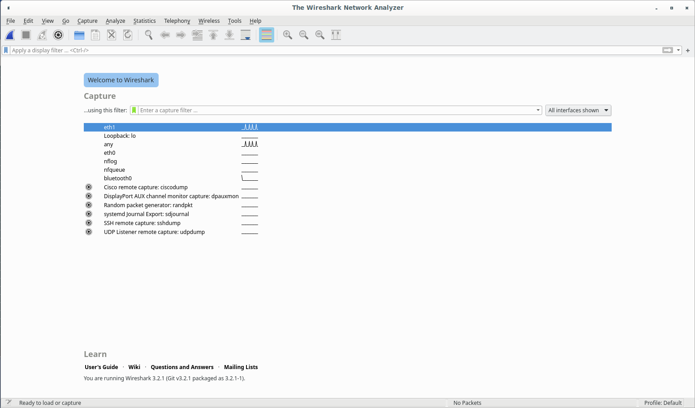
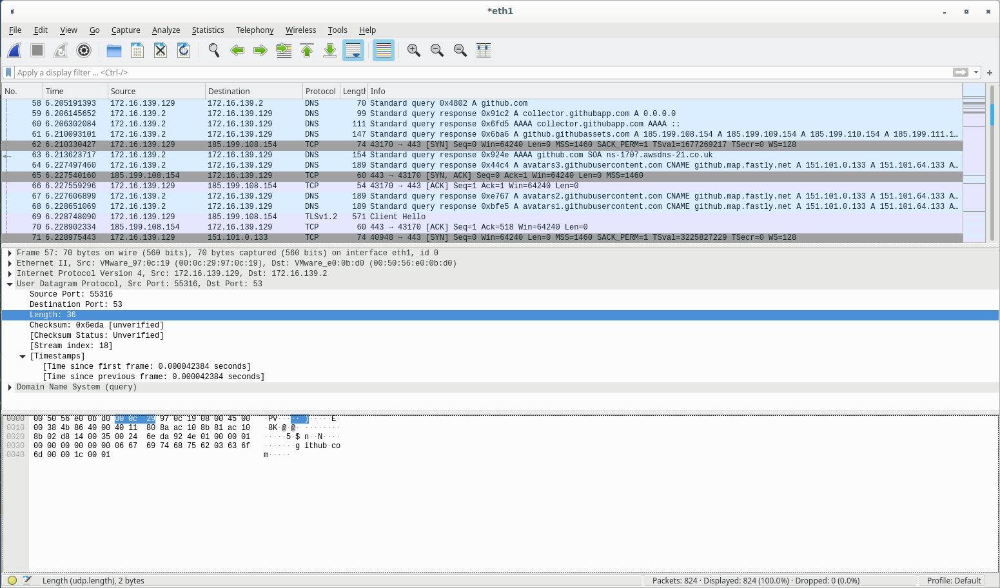
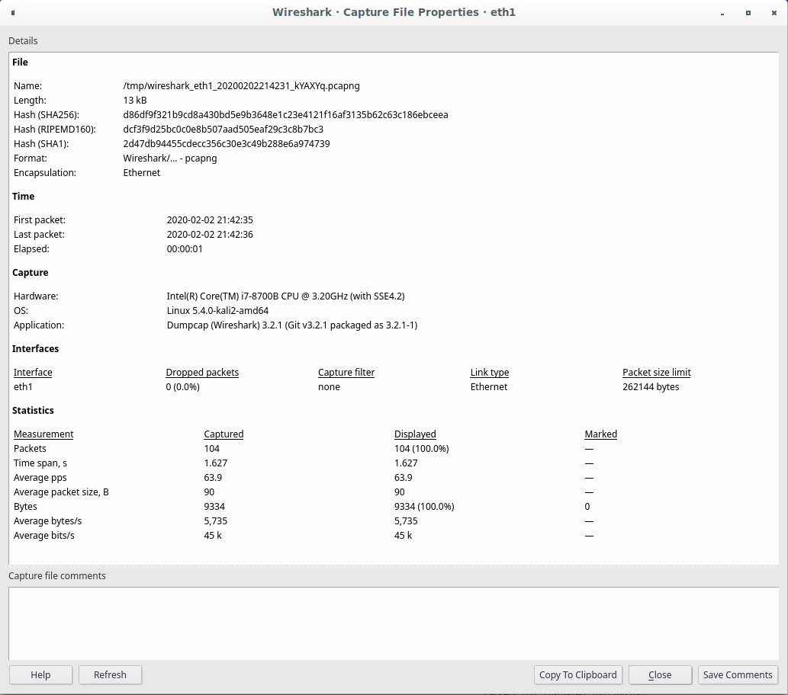
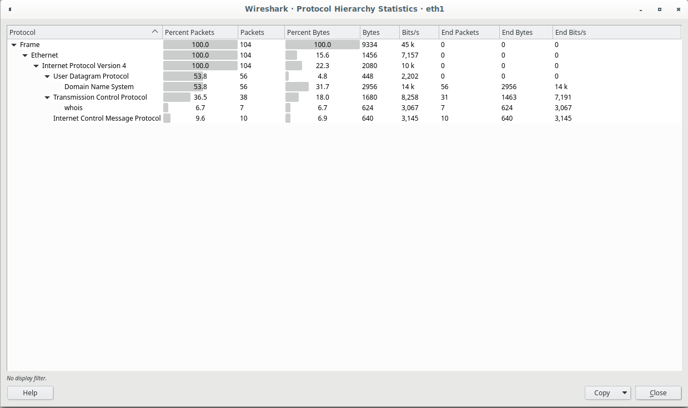
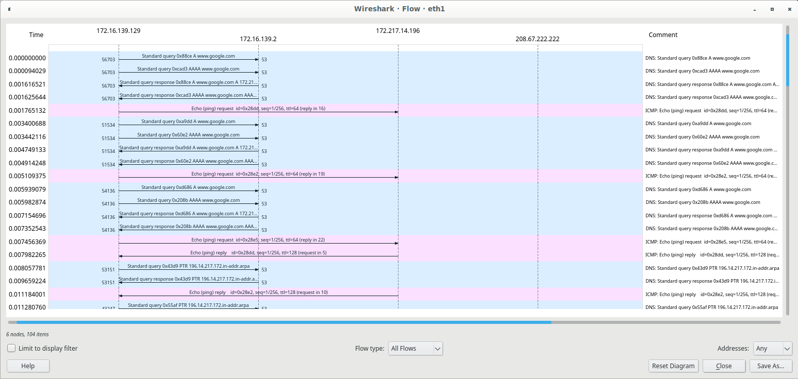
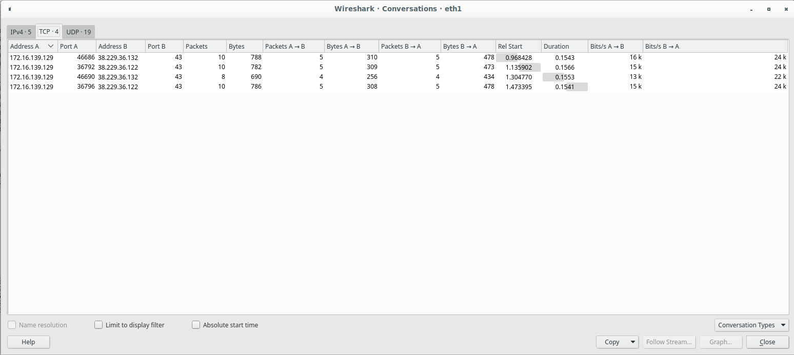

* auto-gen TOC:
{:toc}

## Introduction

Up to now, we've been doing all our packet captures on the command line, and any filters get applied at the point of capture. If you are confident in your filters and know for sure what you want to capture, this is totally fine -- why capture more data than you want or need? However, we often aren't in that situation. Quite often, the capture is exploratory in nature, or it turns out we want just a single flow but didn't know that at the time of capture, or any number of other reasons that we end up capturing more than is "necessary".

Even if, like me, you eventually decide that you prefer capturing at the command line, but post-processing the data in another tool. Usually, that other tool is Wireshark. In many ways, Wireshark is the GUI version of tcpdump. They use the same underlying libpcap to capture packets, after all. Wireshark will even open tcpdump capture files and let you process them to your hearts content!

## Filters

When we were working with tcpdump, filters were filters, they were in BPF format, and that was that. In Wireshark, things are a little more complex, in that there are two different types of filters, they are applied in different ways, and they use completely different syntax.

### Capture filters

When you first launch wireshark, you get the Welcome screen seen below. This is where you instantiate any necessary capture filters you might want to use.



Capture filters here are passed to libpcap, and therefore use the same syntax as tcpdump filters (BPF). These filters limit the traffic captured, and therefore if you want more data, you need to run a new capture with new filters in place (or none).

In order to actually capture data, instantiate whatever filter you want and simply hit the shark fin button in the upper left corner -- this will launch a capture. If you want to stop the capture, hit the big red stop square next to the shark fin.

## Display filters

Display filters, on the other hand, purely limit the data presented at the time. Entered in the textbox you see below (at the top of the window), it filters data seen in the top pane of the screen (known as the packet list pane -- the middle pane is the packet details pane, and the bottom is the packet bytes pane).



As you can see at the bottom of the wireshark window, capture statistics are shown (Packets: 24 Displayed: 24 (100.0%)). As you add display filters, the proportion of packets displayed will vary.

### Display filter syntax

Display filters are logical expressions that evaluate to a truth value for each packet. They can be combined using boolean operators. See the two tables below (taken from the wireshark documentation) for the operators -- you can use either the English or C-like variant, as you desire.

Logical operators:

|---|---|---|---|
| English | C-like | Description | Example |
| eq | ==  | Equal | `ip.src == 10.0.0.5` |
| ne | != | Not equal | `ip.src != 10.0.0.5`|
| gt | > | Greater than | `frame.len > 10` |
| lt | < | Less than | `frame.len < 128` |
| ge | >= | Greater than or equal to | `frame.len ge 0x100` |
| le | <= | Less than or equal to | `frame.len <= 0x20` |
| contains | | Protocol, field or slice contains a value | `sip.To contains "a1762"` |
| matches | ~ | Protocol or text field matches a Perl-compatible regular expression | `http.host ~ "acme\.(org|com|net)"` |
| bitwise_and | & | Bitwise AND is non-zero | `tcp.flags & 0x02` |
| | | | |

Source: [Wireshark Documentation](http://www.wireshark.org/docs/wsug_html_chunked/ChWorkBuildDisplayFilterSection.html)

Boolean operators:

|---|---|---|---|
| English | C-like | Description | Example |
| and | && | Logical AND | `ip.src==10.0.0.5 and tcp.flags.fin` |
| or | \|\| | Logical OR | `ip.src==10.0.0.5 or ip.src==192.1.1.1` |
| xor | ^^ | Logical XOR | `tr.dst[0:3] == 0.6.29 xor tr.src[0:3] == 0.6.29` |
| not | ! | Logical NOT | `not llc` |
| […​] | | Subsequence | See “Slice Operator” below. |
| in | | Set Membership | `http.request.method in {"HEAD" "GET"}`. See “Membership Operator” below.

Source: [Wireshark Documentation](http://www.wireshark.org/docs/wsug_html_chunked/ChWorkBuildDisplayFilterSection.html)

Every field in every protocol that Wireshark understands has a type, of which there are only a small number:

* unsigned integer -- can be 8, 16, 32, or 64 bits,
* signed integer -- can be 8, 16, 32, or 64 bits,
* boolean -- must be compared, presence is there whether it's true or false,
* ethernet address (hardware address) -- can be separated by one of colon, dot, or dash and can be grouped into 1 or 2 bytes between separators,
* IPv4 address -- can be CIDR notation,
* IPv6 address -- can also match subnets,
* text strings.

All of the above seems pretty straightforward, and should feel comfortable if you've ever written a program before (which I assume you have or you wouldn't be here). Here's where things get wonky. For instance, slicing syntax: `tr.src[0:3]`...it looks like python, right? Well, not so much. The syntax is `object[n:m]` where n is the starting index, and m is the length. If you would prefer a python style start:end, the syntax is `object[n-m]`. Simple, right? I can't even tell you how often I mess that one up, so be aware.

Please see the [wireshark documentation on filters](https://www.wireshark.org/docs/wsug_html_chunked/ChWorkBuildDisplayFilterSection.html) for more details. 

## Working with packet traces

One of the greatest strengths of wireshark is that you can work with a subset of the full trace, while leaving the full trace intact. While you could certainly do this with tcpdump and combining reading a trace with a new filter and then writing that output to a new file, that can be cumbersome. Within wireshark, we have a lot of capabilities to filter down in real time without fussing with temporary files, lots of copies, or otherwise wasting time.

### Marking packets

Marking packets is one of the most useful aspect of wireshark. While capturing packets, you may (in fact almost certainly will) grab significantly more packets than just those in which you are interested. By combining display filters, you can mark all packets you're interested in and then use the export settings to get a "sub-trace" -- it's like a subset, but of a trace rather than a set -- of just those packets. Sometimes we mark packets we want to keep, sometimes we mark packets to toss. Depending on which is the least work, I use both at different times.

### Following streams

A stream is a collection of packets that form a single coherent flow of information. Containing both directions, streams are a useful concept within wireshark. If you right click on a packet (any packet), and select Follow, a sub-menu will open allowing you to select the specific protocol that you want to follow. Quite often, a TCP stream may contain significantly more information than any single packet. This has become less useful in recent times due to the rise of HTTPS (there are ways around that -- you're looking for SSLKEYLOGFILE if you're curious about one of the ways), but often things transferred around on "secure" networks rely on policy and physical security, rather than encryption, and so it still becomes really quite useful.

### Capture statistics

Wireshark has an entire Statistics menu. A few of the more useful (for me, anyway) options are captured below.

* Capture file properties shows descriptive statistics about the capture:

  

* Protocol hierarchy shows how many packets of any given protocol are contained within the capture:

  

* Flowgraph shows flows of packets in time between hosts:

  

* Conversations is similar, but textual in nature:

  

* There are other useful tools within the statistics menu, but these are the options I use most frequently.

## Combining with tcpdump

This is actually how I use wireshark. I prefer using `tcpdump` to actually capture packets for lots of reasons, but primarily overhead. That said, at times it's useful to use wireshark to actually visualize the packets, track the streams, etc. A really cool aspect is that you can stream the packets over a network connection -- I've used ssh, but I tend to use `netcat` more. By launching `wireshark` from the command line with the arguments `'-k -i -'` you tell it to start capturing immediately from the "interface" of standard input. This allows for a remote capture with local analysis. VERY useful on systems with constrained resources or no local storage.

As an example:

```sh
┌─(ROOT@kali478-0:pts/4)────────────────────────────────────────────────────────────────────────(~)─┐
└─(20:51:>)── tcpdump -U -s0 -i eth1 -w - | wireshark -k -i -                                 ──(Sun,Feb02)─┘
```

In the above, you can easily replace the pipeline with some form of network communication. As mentioned, you could `use` ssh to execute the line about and it will execute the first portion on the remote host and the righthand side of the pipeline locally. You could also set up a listening socket via `netcat` and pipe the output to that socket from a remote host -- this is usually easier than ssh on low-resource or functionality-constrained devices such as routers or IoT devices.

## `tshark` -- wireshark on the command line

`tshark` is the CLI version of wireshark. Often seen as an alternative to `tcpdump`, in most ways it is simply `tcpdump` with more useful defaults. Please refer to the `tshark` manpage for more details. Much like the Lua comment below, this is more of an existence notice.

## Extending wireshark via the Lua scripting interface

Other than mentioning its existence, I won't be saying much about the Lua extension interface. Here you can find the documentation for the APILinks to an external site.

## Using wireshark with non-ethernet sources

Wireshark can be used in some places where tcpdump can't follow. Specifically, tcpdump will capture any IP protocol from any IP-like network interface. That's all well and good when all you want is IP traffic. But sometimes we want more than that. Wireshark brings a couple specific extensions to the table that are worth bringing up.

### Bluetooth capture

While bluetooth is often spoken of as if it was an IP networking protocol, it is in fact a serial protocol. Essentially, it's a wireless UART (I'm simplifying, and it depends on profile, but most act this way, though BLE is a totally different beast). Wireshark supports capture as well as packet dissection for bluetooth.

### USB capture

USB is another place where wireshark can come to the rescue if you ever need to examine things at the protocol level. I do hope, for your sake, you're never tasked with USB analysis, but if you are, wireshark may well become your best friend.

## Optional Additional Resources
Some suggested viewing/reading for additional in-depth coverage:

Wireshark TutorialLinks to an external site. by Hackersploit:
An excellent overview of what Wireshark can do, presented in a very informative way.
Hak5 on wiresharkLinks to an external site.:
A more casual, entertaining introduction to Wireshark. Hak5 has some excellent content on a variety of topics, and are always good for some casual hardware/software hacking shenanigans.
Wireshark User's GuideLinks to an external site.:
Everything you ever wanted to know about Wireshark (but didn't realize it).
Wireshark WikiLinks to an external site.:
Even more Wireshark!
Wireshark® for Security Professionals: Using Wireshark and the Metasploit® Framework, ISBN 978-1-118-91821-0. Published by John Wiley & Sons, Inc.